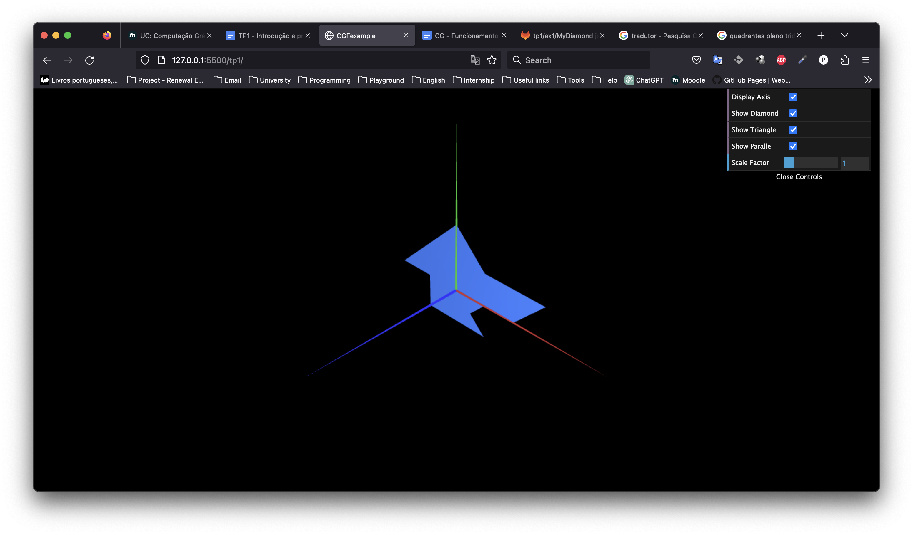

# CG 2022/2023

## Group T04G03

## TP 1 Notes

(add your main observations/remarks about your experiments here, in a bulleted list, and remove this line. Some examples below)

- In exercise 1 we observed that when declaring the indices in the class object, the order of the vertices sequence matters. For example, if we have as veticies sequence "0, 1, 2", the triangle would appear in the first octet. But switching the order to "2, 1, 0", the triangle would appear in the second octet. Also, we spent some time trying to define the two checkbox controllers. In the end, we just needed to add two boolean variables (showDiamond and showTriangle), set both to true in the beggining of the program, and only display it if the checkbox was set to true (this is, when the show<Object> variable was set to true).
- In exercise 2 we had difficulties in defining the vertices sequence in figure 6. We found that we needed to draw two triangles in order to get a square.

